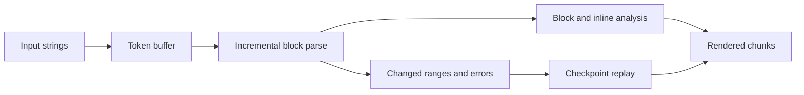

# Markdown Stream Parser

`@lixpi/markdown-stream-parser` incrementally parses Markdown from token streams. It emits plain rendered text with block context, inline span metadata, and correction offsets that a consumer can apply to its output buffer.

The parser uses the block and inline grammars from `tree-sitter-markdown`. It does not render HTML and does not depend on a UI framework.

The project is under active development. Review [Supported Markdown](#supported-markdown) and [Limitations](#limitations) before using it in a production rendering path.

- [Live demo](https://markdown-stream-parser.lixpi.org)
- [Repository](https://github.com/Lixpi/markdown-stream-parser)


## Installation

Install the package with your package manager:

```bash
pnpm add @lixpi/markdown-stream-parser
```

```bash
npm install @lixpi/markdown-stream-parser
```

```bash
yarn add @lixpi/markdown-stream-parser
```

ES modules and CommonJS entry points are declared by the package:

```typescript
import { MarkdownStreamParser } from '@lixpi/markdown-stream-parser'
```

```javascript
const { MarkdownStreamParser } = require('@lixpi/markdown-stream-parser')
```

## WASM Assets

The parser needs three WASM files at runtime:

- `tree-sitter.wasm` from `web-tree-sitter`
- `tree-sitter-markdown.wasm`
- `tree-sitter-markdown-inline.wasm`

The package does not copy these assets into an application. Copy or serve them as part of your deployment before creating a parser instance.

In a browser, `web-tree-sitter` resolves its runtime as `/tree-sitter.wasm`. The Markdown grammars default to `/tree-sitter-markdown.wasm` and `/tree-sitter-markdown-inline.wasm`.

Call `configureWasmPath()` before the first call to `getInstance()` when the grammar files use different paths:

```typescript
MarkdownStreamParser.configureWasmPath(
    '/parsers/tree-sitter-markdown.wasm',
    '/parsers/tree-sitter-markdown-inline.wasm'
)
```

If the second argument is omitted, the inline path is derived by replacing `.wasm` with `-inline.wasm` in the Markdown grammar path.

In Node.js, the grammar defaults are `./wasm/tree-sitter-markdown.wasm` and `./wasm/tree-sitter-markdown-inline.wasm`. Pass filesystem paths to `configureWasmPath()` when the assets are stored elsewhere.

## Quick Start

Each logical stream uses an instance ID. `getInstance()` is asynchronous because the first call initializes `web-tree-sitter` and loads both grammars.

Subscribe before calling `startParsing()`, feed string chunks with `parseToken()`, and finish with `stopParsing()` so buffered content is flushed.

```typescript
import {
    MarkdownStreamParser,
    type Chunk,
} from '@lixpi/markdown-stream-parser'

const instanceId = 'response-42'
const parser = await MarkdownStreamParser.getInstance(instanceId)

let renderedText = ''

const unsubscribe = parser.subscribeToTokenParse((event) => {
    if (event.status === 'START_STREAM') {
        renderedText = ''
        return
    }

    if (event.status === 'END_STREAM') {
        return
    }

    applyChunk(event.chunk)
})

function applyChunk(chunk: Chunk): void {
    if (chunk.backtrackOffset !== undefined) {
        renderedText = renderedText.slice(0, chunk.backtrackOffset)
    }

    renderedText += chunk.text
}

parser.startParsing()

for (const token of ['## ', 'Hello ', '**world**', '\n']) {
    parser.parseToken(token)
}

parser.stopParsing()
unsubscribe()
MarkdownStreamParser.removeInstance(instanceId)
```

`getInstance()` returns the same parser for repeated calls with the same instance ID. Use different IDs for independent streams, and call `removeInstance()` when a stream no longer needs to be retained.

## Stream Lifecycle

The subscriber receives a discriminated union:

```typescript
type StreamingChunk =
    | { status: 'START_STREAM' }
    | { status: 'STREAMING'; chunk: Chunk }
    | { status: 'END_STREAM' }
```

The lifecycle is:

1. `subscribeToTokenParse(listener)` registers a listener and returns an unsubscribe function.
2. `startParsing()` resets accumulated parser state and emits `START_STREAM`.
3. `parseToken(chunk)` adds a string to the input buffer. Complete buffered segments may produce `STREAMING` events.
4. `stopParsing()` flushes buffered input and incomplete inline content, emits `END_STREAM`, and stops the session.
5. `removeInstance(instanceId)` stops and removes the retained parser instance.

Calling `parseToken()` before `startParsing()` returns an `Error`. Calling `startParsing()` while the parser is running leaves the active session in place.

Multiple listeners can subscribe to one parser instance. Each listener receives the event and an unsubscribe function as arguments:

```typescript
const unsubscribe = parser.subscribeToTokenParse((event, unsubscribeListener) => {
    if (event.status === 'END_STREAM') {
        unsubscribeListener()
    }
})
```

## Output Model

A `STREAMING` event contains a `Chunk`:

```typescript
type Chunk = {
    text: string
    offset: number
    length: number
    block: BlockContext
    opening: OpenSpan[]
    closing: ClosedSpan[]
    contained: ClosedSpan[]
    backtrackOffset?: number
    recovery?: RecoveryInfo
    original?: string
}

type RecoveryInfo = {
    type: 'window_overflow'
    windowSize: number
    fullBacktrackOffset: number
    appliedBacktrackOffset: number
}
```

`text` contains rendered text with recognized Markdown syntax removed. `offset`, `length`, span positions, and `backtrackOffset` use UTF-16 code units in the rendered output coordinate space. This matches JavaScript string indexing and `String.prototype.slice()`.

`block` describes the surrounding block:

```typescript
type BlockContext = {
    type:
        | 'paragraph'
        | 'heading'
        | 'code_block'
        | 'list_item'
        | 'table'
        | 'table_row'
        | 'table_header_cell'
        | 'table_cell'
        | 'blockquote'
    level?: number
    language?: string
    list?: {
        type: 'ordered' | 'unordered'
        depth: number
        marker: '-' | '+' | '*' | '.' | ')'
        ordinal?: number
        task?: { checked: boolean }
    }
    table?: {
        tableId: string
        rowIndex: number
        columnIndex: number
        cellId: string
        align?: 'left' | 'center' | 'right'
    }
}
```

`level` applies to headings. `language` contains the info string detected on a fenced code block.

`list` is present when the chunk is inside a list item. `depth` is zero-based. Unordered items use `marker` for the bullet character (`-`, `+`, or `*`). Ordered items use `marker` for the delimiter only (`.` or `)`) and put the number in `ordinal` when it is safely representable as a JavaScript number. Task list items omit the `[x]`, `[X]`, or `[ ]` marker from rendered text and expose `task.checked`.

`table` is present when the chunk is inside a table cell. `tableId` identifies the enclosing table, `rowIndex` is zero-based with the header row at `0`, `columnIndex` is zero-based within the row, `cellId` is a stable `${tableId}:${rowIndex}:${columnIndex}` grouping key, and `align` reflects the parsed delimiter row when specified.

Chunks are streamed at content boundaries, not at Markdown table-cell boundaries. One Markdown cell can produce multiple chunks. Consumers that need to rebuild a visual table should group chunks by `block.table.tableId`, then by `rowIndex`, then by `cellId`.

Compatibility note: header cell chunks now use `block.type === 'table_header_cell'`. Consumers that previously treated all table header content as `table_cell` should update that branch.

When `includeRawStreamedToken` is enabled, `original` contains the raw Markdown source associated with the emitted chunk. It is separate from the rendered UTF-16 coordinate space.

## Inline Spans

Chunks and inline spans are independent. A span can be contained by one chunk or cross chunk boundaries.

```typescript
type Span =
    | { type: 'bold' }
    | { type: 'italic' }
    | { type: 'code' }
    | { type: 'strikethrough' }
    | { type: 'link'; url: string }
    | { type: 'image'; src: string; alt?: string }

type OpenSpan = {
    type: Span['type']
    openOffset: number
}

type ClosedSpan = Span & {
    offset: number
    length: number
}
```

- `opening` lists spans that start in the chunk and remain open.
- `closing` lists spans that started in an earlier chunk and close in this chunk.
- `contained` lists complete spans represented within the chunk.

Consumers that maintain active span state can match a closing span to an opening span by `type` and by comparing `OpenSpan.openOffset` with `ClosedSpan.offset`.

```typescript
import type { Chunk, OpenSpan } from '@lixpi/markdown-stream-parser'

let openSpans: OpenSpan[] = []

function updateSpanState(chunk: Chunk): void {
    if (chunk.backtrackOffset !== undefined) {
        openSpans = openSpans.filter(
            (span) => span.openOffset < chunk.backtrackOffset!
        )
    }

    openSpans.push(...chunk.opening)

    for (const closed of chunk.closing) {
        const index = openSpans.findIndex(
            (open) =>
                open.type === closed.type &&
                open.openOffset === closed.offset
        )

        if (index !== -1) {
            openSpans.splice(index, 1)
        }
    }
}
```

Links include their URL when closed. Images include `src` and may include `alt`.

## Error Recovery

Markdown structure can change as more source arrives. A line initially emitted as a paragraph can become part of a table or fenced code block, for example.

When previously emitted output is affected, the first replacement chunk includes `backtrackOffset`. The consumer must:

1. Remove rendered output from `backtrackOffset` onward.
2. Remove derived block and span state at or after that offset.
3. Apply the replacement chunk and subsequent chunks in order.

```typescript
if (chunk.backtrackOffset !== undefined) {
    output = output.slice(0, chunk.backtrackOffset)
    openSpans = openSpans.filter(
        (span) => span.openOffset < chunk.backtrackOffset!
    )
}

output += chunk.text
```

A correction may contain an empty `text` value when stale output must be deleted without replacement. Apply `backtrackOffset` even when `chunk.length` is zero.

## Configuration

Pass configuration when creating an instance or merge it into an existing instance with `setConfig()`:

```typescript
const parser = await MarkdownStreamParser.getInstance('response-42', {
    includeRawStreamedToken: true,
    windowSize: 500,
})

parser.setConfig({ windowSize: 1000 })
const config = parser.getConfig()
```

| Option | Type | Default | Behavior |
| --- | --- | --- | --- |
| `includeRawStreamedToken` | `boolean` | `false` | Adds the associated raw Markdown source to `chunk.original`. |
| `windowSize` | `number` | `undefined` | Requests a maximum correction distance in rendered UTF-16 code units. See the recovery limitation below. |

`windowSize` must be finite and greater than or equal to `0`; invalid values throw `RangeError`. `setConfig()` performs a shallow merge, so omitted properties retain their values.

## Supported Markdown

The parser handles these structures in its exercised parsing paths:

- Paragraphs and ATX headings (`#` through `######`)
- Fenced code blocks with language detection
- Ordered, unordered, nested, loose, and task list items
- Bold, italic, bold-italic, strikethrough, and inline code spans
- Pipe tables with header-cell detection, delimiter suppression, alignment metadata, and stable per-cell grouping keys for covered table forms

Link and image span extraction is implemented, including URL and image metadata, but dedicated coverage is still needed for those paths.

These structures are incomplete or unsupported:

- Blockquote marker stripping and nested blockquotes
- Full coverage for every valid Markdown table shape
- Horizontal rules
- Footnotes
- HTML blocks
- Autolinks
- Emoji shortcodes
- Superscript and subscript extensions

Escaped inline markers pass through the delimiter logic, but escaping behavior does not yet have complete feature coverage.

## Limitations

### Recovery Window

`windowSize` is measured in rendered UTF-16 code units. When a complete correction would require replay before `lastEmittedOffset - windowSize`, the parser chooses the earliest stored checkpoint inside the configured window and attaches recovery metadata to the first replacement chunk:

```typescript
if (chunk.recovery?.type === 'window_overflow') {
    console.warn('Correction was truncated to the configured window', chunk.recovery)
}
```

`recovery.fullBacktrackOffset` is where complete replay would have started. `recovery.appliedBacktrackOffset` equals `chunk.backtrackOffset` and is the bounded offset consumers should apply. Output before `appliedBacktrackOffset` may remain stale because the parser did not ask the consumer to discard outside the configured window.

Leave `windowSize` undefined when a consumer requires complete recovery.

### Recovery Coverage

Recovery is covered for table and code-fence reclassification, rendered offsets, raw source output, and bounded lookback behavior. Dedicated cases are still needed for:

- Inline delimiter replay with opening and closing spans
- Corrections that only delete stale rendered output

### Long Streams

Checkpoint history is copied as segments are emitted and searched linearly during recovery. Error detection also traverses the syntax tree after streamed input. These paths can accumulate disproportionate work as a document grows.

Long uninterrupted input is emitted in bounded chunks by the token buffer, but output can still be delayed until the buffer reaches its internal threshold or receives whitespace.

## Runtime Design

The parser maintains one block syntax tree and one inline parser per instance. Incoming strings pass through a token buffer before incremental parsing. Generated chunks carry rendered offsets, while internal state also retains source offsets for replay.



Tree-sitter changed ranges and syntax errors identify source positions that may invalidate emitted output. Recovery selects a stored checkpoint, reconstructs generator state, and replays source from that checkpoint. Public offsets remain in rendered UTF-16 coordinates even though recovery decisions use raw source positions internally.

## Development

The repository's Docker service installs the root and demo dependencies. Start it from the repository root:

```bash
docker compose up -d
```

Run the test suite in the service container:

```bash
docker exec -it lixpi-markdown-stream-parser-demo pnpm test:run
```

Run the package build:

```bash
docker exec -it lixpi-markdown-stream-parser-demo pnpm run build
```

### Debug a Recorded Stream

Recorded streams live under `demo/llm-streams-examples`. JSON files preserve chunk boundaries; matching text files provide the combined Markdown for comparison.

```bash
docker exec -it lixpi-markdown-stream-parser-demo \
    pnpm run debug-parser-tree-sitter \
    --file=demo/llm-streams-examples/claude-3.5-long-regex.json
```

Create a chunked JSON stream from a text fixture:

```bash
docker exec -it lixpi-markdown-stream-parser-demo \
    pnpm run split-sample-into-chunks -- \
    --file=demo/llm-input-examples-raw-text/long-consecutive-sequence.txt \
    --chunkSize=2 \
    --outputPath=demo/llm-stream-examples-manually-simulated/long-consecutive-sequence.json
```

## Development Priorities

Recovery work focuses on a strict `windowSize` overflow contract, inline-span replay coverage, and deletion-only correction coverage.

Scaling work focuses on stable-boundary checkpoints, pruning and indexed lookup, parser-internal checkpoint storage, changed-subtree error inspection, tracked unresolved errors, and long-stream benchmarks.

Markdown coverage work focuses on the incomplete structures listed in [Supported Markdown](#supported-markdown).

## Contributing

Bug reports, implementation proposals, and pull requests are welcome. Use [GitHub Discussions](https://github.com/Lixpi/markdown-stream-parser/discussions) for design questions and the repository issue tracker for reproducible defects.

## License

MIT
